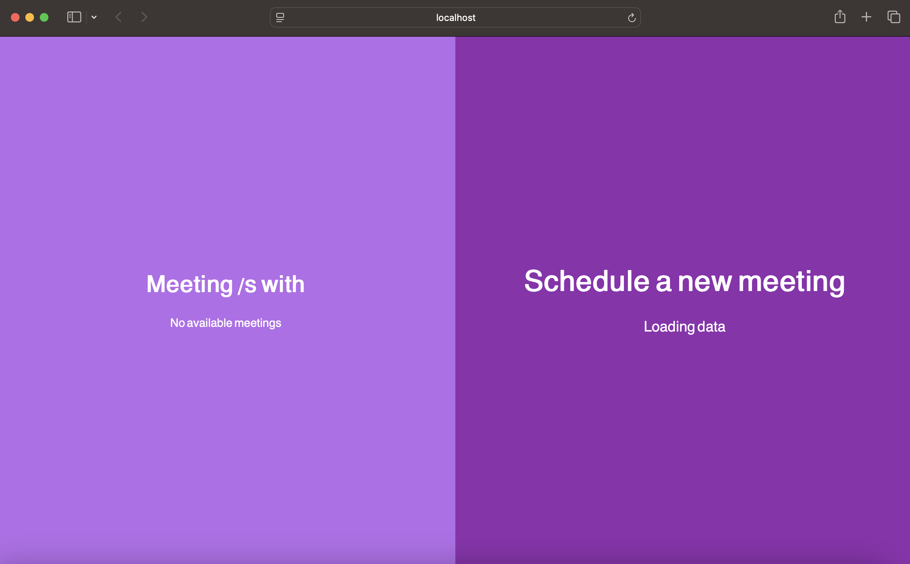

# Just a Meeting - React TypeScript & Spring Boot

### Meeting List & Schedule Form
https://github.com/shlomiaflalo/Just-a-react-meeting/blob/main/Screenshot%202025-04-01%20at%2005.38.03.png

https://github.com/shlomiaflalo/Just-a-react-meeting/blob/main/5E8DDDBC-A4A6-472D-81BD-2A1EBF70F853.jpeg


## Overview
This is a simple meeting scheduling application built using **React with TypeScript** on the frontend and **Spring Boot** on the backend. The application allows users to:

- View existing meetings for a specific tech group
- Schedule a new meeting by providing details such as time, description, and room name

## Features
- **Meeting List**: Displays a list of scheduled meetings with details such as start time, end time, description, and location.
- **Meeting Scheduling Form**: Users can add a new meeting by selecting the group, time, and room.
- **Loading States**: Displays a loading message when fetching data.
- **No Meetings State**: Displays a message when no meetings are available.

## Technologies Used
### Frontend:
- **React** (with TypeScript)
- **Styled Components / CSS** for styling
- **Axios** for API calls

### Backend:
- **Spring Boot** (Java)
- **Spring Web** for API endpoints
- **Spring Data JPA** for database management
- **H2/PostgreSQL** (or any SQL database) for storing meetings

## Project Structure
```
📂 tech_groups
├── 📂 .idea
├── 📂 node_modules
├── 📂 public
├── 📂 src
│   ├── 📂 Components
│   │   ├── 📂 LayoutArea
│   │   │   ├── 📂 Main
│   │   │   │   ├── Main.css
│   │   │   │   ├── Main.tsx
│   │   │   ├── 📂 Meetings
│   │   │   │   ├── Meetings.css
│   │   │   │   ├── Meetings.tsx
│   │   │   ├── 📂 TechGroup
│   │   │   │   ├── TechGroupSide.css
│   │   │   │   ├── TechGroupSide.tsx
│   ├── 📂 Routing
│   ├── 📂 SplitScreens
│   ├── 📂 Config
│   ├── 📂 Models
│   ├── 📂 Services
│   ├── App.tsx
│   ├── index.css
│   ├── main.tsx
│   ├── vite-env.d.ts
├── .gitignore
├── eslint config.js
```

## Setup & Installation
### Backend (Spring Boot)
1. Clone the repository:
   ```bash
   git clone https://github.com/yourusername/meeting-scheduler.git
   ```
2. Navigate to the backend folder:
   ```bash
   cd backend
   ```
3. Build and run the Spring Boot application:
   ```bash
   mvn spring-boot:run
   ```
4. The API will be available at `http://localhost:8080/api/meetings`

### Frontend (React + TypeScript)
1. Navigate to the frontend folder:
   ```bash
   cd frontend
   ```
2. Install dependencies:
   ```bash
   npm install
   ```
3. Start the development server:
   ```bash
   npm start
   ```
4. Open `http://localhost:3000` in your browser.

## API Endpoints
- `GET /api/meetings` - Fetch all scheduled meetings
- `POST /api/meetings` - Create a new meeting
- `DELETE /api/meetings/{id}` - Delete a specific meeting

## Screenshots
### Meeting List & Schedule Form


### No Meetings State


## Contributing
1. Fork the project
2. Create your feature branch (`git checkout -b feature-name`)
3. Commit your changes (`git commit -m 'Add feature'`)
4. Push to the branch (`git push origin feature-name`)
5. Create a Pull Request

## License
This project is licensed under the MIT License.
